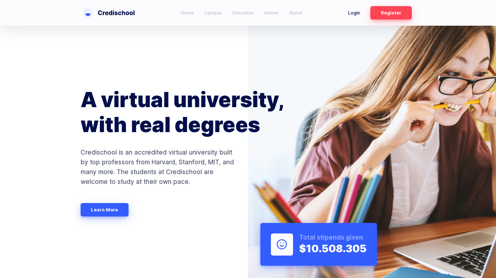

<p align="center">
  
</p>

<p align="center">
  
  
  

  
</p>

<h1 align="center">
</h1>

<br>

## 🧪 Technologies

This project was developed using the following technologies:

- [ReactJS](https://reactjs.org/)
- [Sass](https://sass-lang.com/documentation/)
- [Storybook](https://storybook.js.org/)

## 🚀 Getting started

Clone the project and access the folder.

```bash
git clone https://github.com/NitoBa/virtual-university-landing-page.git

cd virtual-university-landing-page
```

Run this command to install the dependencies:

```bash
npm install

npm run dev
```

Run this command to view components through the storybook:

```bash
npm run storybook
```

## 🔖 Layout

You can view the layout through the link below:
- [Layout](https://www.figma.com/file/43CBYZ1fX4XQMMd1qoVmkM/Virtual-University-Landing-Page-(Community)?node-id=0%3A1)

You can view the project through the link below:

- [Live Preview](https://virtual-university-landing-page.vercel.app/)

## 📝 License

This project is licensed under the MIT License. See the [LICENSE](LICENSE) file for details.

---

Made with 💜 by [Bruno Alves](https://profile-website-murex.vercel.app/) 👋